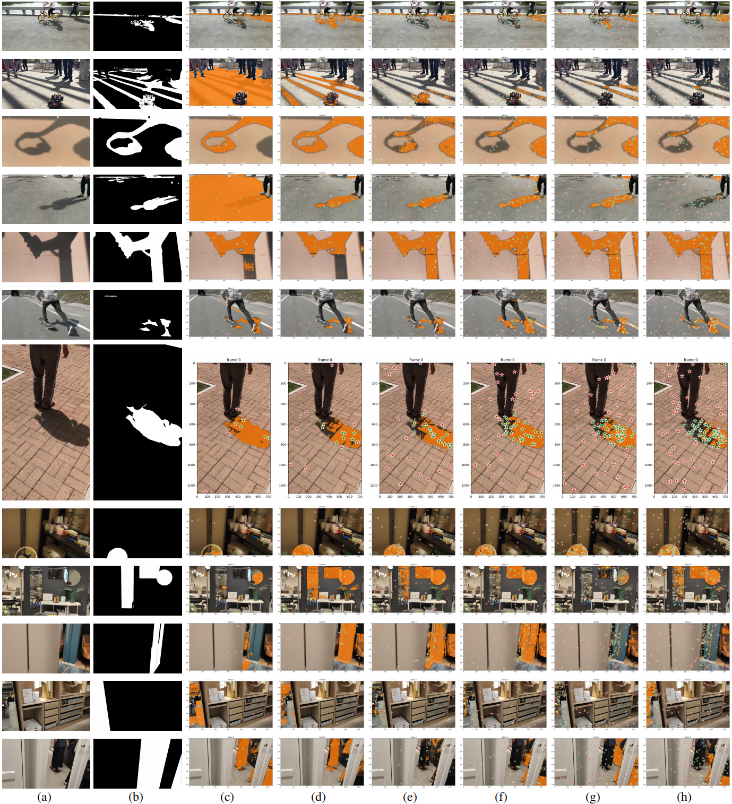

# SAM2Video

Source code for our technical report [&#34;When SAM2 Meets Video Shadow and Mirror Detection&#34;](https://github.com/LeipingJie/SAM2Video). In this report, we evaluate the performance of [SAM2](https://github.com/facebookresearch/sam2) on two video segmentation task: shadow and mirror.

---

## Datasets

* ViSha [click to download](https://erasernut.github.io/ViSha.html)
* VMD [click to download](https://jiaying.link/cvpr2023-vmd/)

## How to use

1. generate all predictions

```
sh test.sh
```

2. eval

```
sh eval_all.sh
```

## Results



All predictions can be downloaded from:
<!--
* [OneDrive] (https://lifehkbueduhk-my.sharepoint.com/:u:/g/personal/17482305_life_hkbu_edu_hk/Eblu2TdCD_pNr3ELsZoKAtYBIwyICd5qrYI1-AAjbd_Clg?e=Cjjrpf) (password: tLZf9rF9QLLfy!BM)
* [Baidu](https://pan.baidu.com/s/1XaIL9PUkmLb_mMGDcGl2fQ) (password: vpbt)
-->
[Baidu](https://pan.baidu.com/s/1XaIL9PUkmLb_mMGDcGl2fQ) (password: vpbt)

## Citation

If you find this code useful in your research, please cite

```
@misc{jie2023sam,
    title={When SAM2 Meets Video Shadow and Mirror Detection},
    author={Leiping Jie},
    year={2024},
    archivePrefix={arXiv},
    primaryClass={cs.CV}
}
```

## Acknowledgment

We thank SAM2 (https://github.com/facebookresearch/sam2) for their excellent work.
